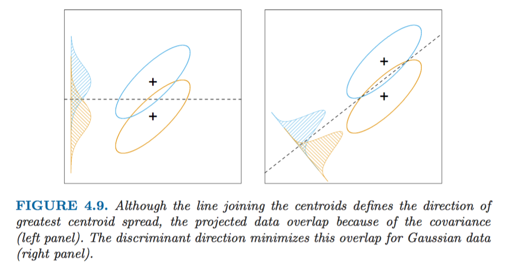
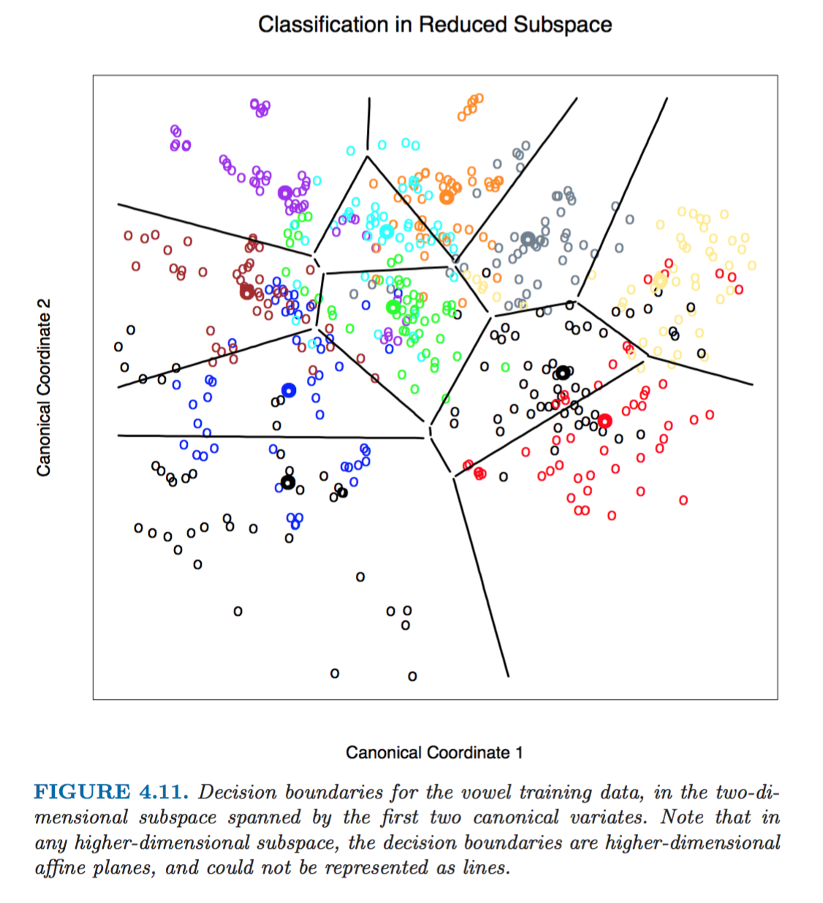
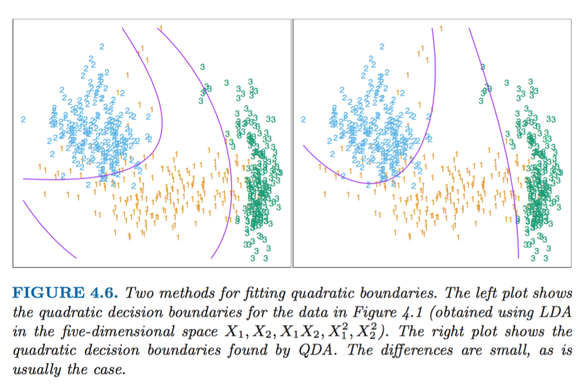
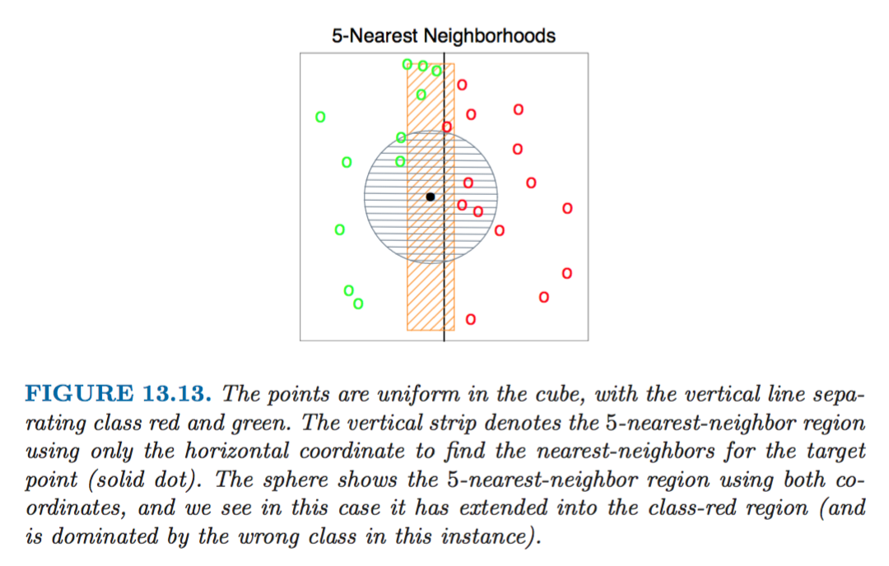
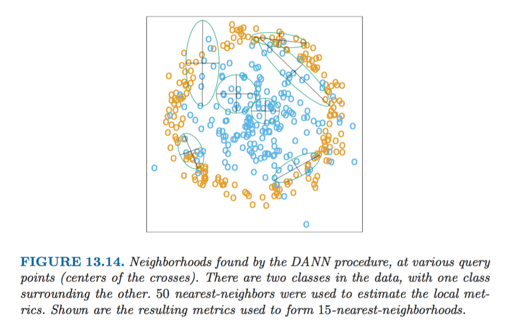

> April 7, 2017

# Discrimination Beyond Good and Evil

****

This is Ronald Aylmer Fisher, Sc.D., F.R.S.
You would probably agree that he looks like a very serious man.

He looks even more serious when his portrait is transformed using the Deep Dream algorithm (you can find the algorithm in the open source [here] ):

[here]:https://deepdreamgenerator.com/generator-style

I believe we can say with the utmost certainty that he was indeed important for the development of statistical analysis. However, as it happens, one of his contributions, __*Fisher's linear discriminant*__, which is the subject of this post, has been invented in the context of [Eugenics], a more than controversial academic discipline that was used, amongst other things, as a justification for Nazism, discrimination against racial minorities and sterilisation of mentally or otherwise disabled patients in US and Europe.  

[Eugenics]:https://en.wikipedia.org/wiki/Eugenics

On the other hand, the discriminant analysis has become one of the fundamental classification methodologies. Since the publication of the [original paper] by Fisher in the "Annals of Eugenics" in 1936 its underlying principles have given rise to a lot of more modern and sophisticated classification techniques popular in machine learning today

[original paper]:http://onlinelibrary.wiley.com/doi/10.1111/j.1469-1809.1936.tb02137.x/abstract

****

* In short, __*Linear discriminant analysis (LDA)*__ solves the classification problem by maximising the distance between the means of the two classes. The original problem that Fisher posed was the following:
        > Find the linear combination Z = (a)^T*X such that the between-
        class variance is maximised relative to the within-class variance

  meaning that the class subsets must be spread out as much as possible in terms of variance, which is not dissimilar to finding principal component subspaces of the classes. As a result the boundary separating the classes would minimise the overlap between them:

  Another very useful mathematical property of LDA is that it allows to view informative low-dimensional projections of the data, performing a dimension reduction without relinquishing any of the information needed for LDA classification. This dimensionality reduction can allow us to view the data in a two-dimensional plot, colour-coding the classes when the actual value of variables is much larger

  > The example below is the classification of vowels (which has 11 classes and 10 variables, and hence 10 possible dimensions for the classifier) represented using the rank reduction using LDA:

  

  On the other hand, LDA has a few strong assumptions about the underlying data distribution, namely the Gaussian distribution of the data and equal covariances of different classes. When the latter condition doesn't hold one can use the Quadratic discriminant analysis below

* __*Quadratic discriminant analysis (QDA)*__, unlike the linear version, doesn't make the assumption that the covariance matrices of the classes are similar.

> In practice the outputs of the LDA and QDA methods are often very similar:

* __*Regularised discriminant analysis*__ is a compromise between the linear and quadratic discriminant analysis where covariance matrices which are different in the assumptions of quadratic discriminant analysis are shrunk towards the common matrix like in linear discriminant analysis case

* __*Discriminant adaptive nearest neighbours (DANN)*__ is an interesting extension of k-nearest neighbours algorithm using the discriminant analysis. One of the problems with the k-nn classifier is that when it is carried out in a high-dimensional feature space,  the nearest neighbours of a point can be very far away, causing bias and degrading the performance of the model. Implicit in near-neighbour classification is the assumption that the class probabilities are roughly constant in the neighbourhood and hence simple averages give good estimates. Imagine that instead we know the direction in which the variance between the classes is the largest, and let's say it's horizontal as on the figure below. Then extending the neighbourhood as a rectangle along the vertical line (the direction *of the lowest between-class variance*) instead of the usual circle would significantly decrease the bias of our model keeping variance constant:

> An example of a two-dimensional case:

In more general terms, the DANN method stretches the neighbourhood in the direction *coinciding with the linear discriminant boundary*, and this is the direction in which the class probabilities change the least.

As this method is repeated at each point and as the direction of the linear discriminant boundary is potentially different for each observation, this provides a more flexible classification method than the simple k-nearest neighbours algorithm:

* A lot of the tricks above are actually generalised by the __*support vector machines (SVM)*__ algorithm. SVM is the generalisation of the Optimally Separating Hyperplane(OSH) algorithms.
  + Similar to the LDA, SVM maximises the distance between the decision boundary and the observations, however unlike LDA SVM only uses nearest points to the boundary (whereas LDA takes into account all the observations)
  + SVM is also more flexible for finding the decision boundaries using the kernel trick to find a hyperplane in higher dimensions that allows to linearly separate the data that can't be linearly separated in the lower dimension.
  + SVM is also often used in conjunction with the hinge loss function and thus is more flexible in cases when the data is not linearly separable and allows for a solution with some of the points misclassified
  + SVM doesn't make any assumptions about the distribution of the underlying data (unlike LDA and QDA)

  > The source of the beautiful graphs and all the extraordinary information in this post is the book
  > __"The Elements of Statistical Learning"__, *Trevor Hastie, Jerome H. Friedman, Robert Tibshirani*, February 2009
