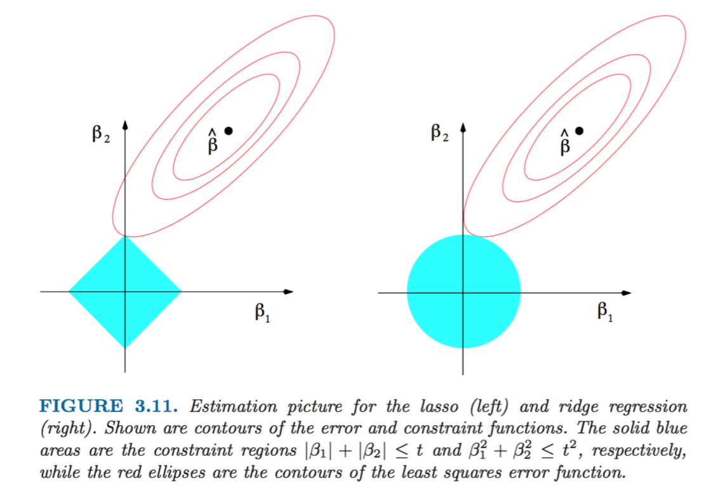
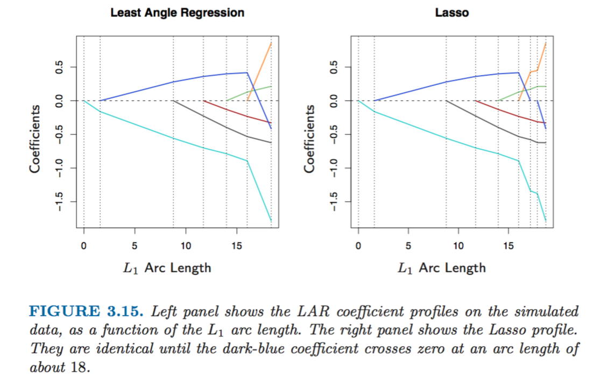
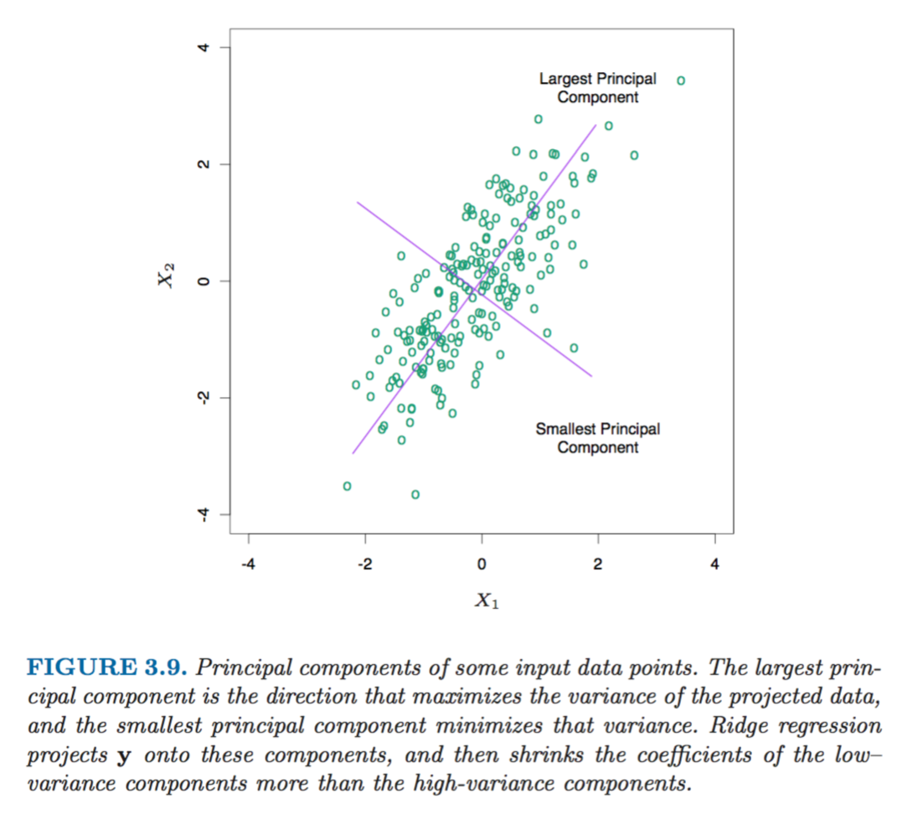
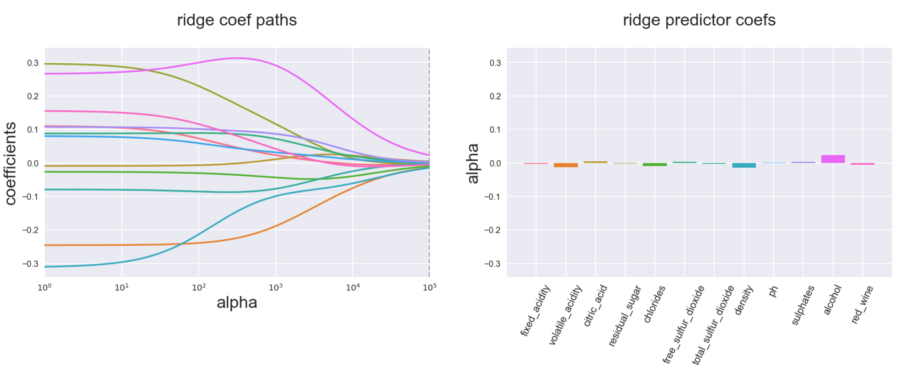
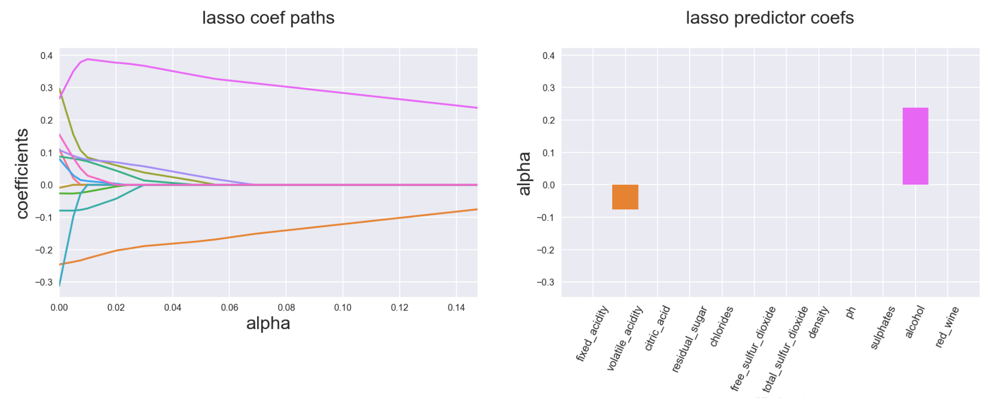
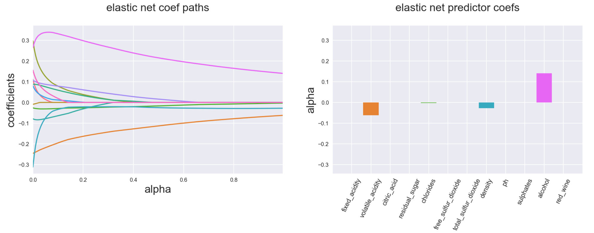

> March 24, 2017

### This is the post about
 
# Extraordinary Least Squares

****

****

Everyone had to use a linear regression at one point or another during their work- (or even life-) time, or at least came accross the concept during University studying time. But what if you could make this mundane tool much more exciting and efficient? Below are the list of things that Data Scientists put on top of the Ordinary Least Squares to make it a bit more extraordinary

### Variables (features) selection
   If you get some data set from the real world to analyse then it would probably have a few variables that would be correlated between each other. Or a few too many variables in total, most of which might not add a tremendous amount of explanatory power to the model. One of the ways to deal with it is to choose a subset of the variables (aka features), but testing each combinatoin can get really tedious (or unfeasible after the number of variables gets too large). Luckily, there are a few algorithms that can help with this problem: 
   
   + __*Leaps and bounds procedure (Furnival and Wilson, 1974)*__
   makes this selection process feasible for the number of variables as large as 30 or 40

  
   + __*Forward- stepwise selection*__
   starts with the intercept, and then sequentially adds into the model the predictor that most improves the fit

   + __*Backward-stepwise selection*__
   starts with the full model, and sequentially deletes the predictor that has the least impact on the fit
   
   + __*Hybrid stepwise-selection*__
   strategies that consider both forward and backward moves at each step, and select the “best” of the two (the _step_ function in    R)
   
   + __*Forward-stagewise regression*__  is even more constrained than forward-stepwise above. It starts like forward-stepwise regression, with an intercept equal to the mean, and then at each step the algorithm identifies the variable most correlated with the current residua, then computes the simple linear regression coefficient of the residual on this chosen variable, and then adds it to the current coefficient for that variable. This is continued till none of the variables have correlation with the residuals. *Although this is the slower algorythm than the other options (it takes more time to arrive at the same optimal solution) it is nevertheless pretty handy in higher dimensions problems*

 > The figure below shows the simulation of methods above on a sample dataset

   
   
### Penalty functions aka Shrinkage
   Another way to improve your model and reduce its variance with a small bias increase trade-off is to minimise not just the residual sum of squares, but also add the constraint for the sum of parameter values. There are a few ways to do this:
   
   + __*Ridge*__
   adds the penalty based on sum of squares of the coefficients estimates. The severity of this penalty is regulated by the parameter lambda *(which is refered to as alpha in Python scikit library)*: the bigger the parameter, the closer all coefficients are being gradually and smoothly shrunk to zero 

  
   + __*Lasso*__
   penalises using the sum of the absolute values of parameters (comparing to squares in Ridge). As a result, the larger your lambda *(alpha)*, the more are the chances that some of the features will be completely excluded from the regression and their coefficients would be set to zero (in contrast to Ridge that gradually brings all coefficients to zero proportionately)

  We can visualise the difference between Ridge and Lasso as the minimisation problem based on the example of 2 coefficient parameters beta1 and beta2. The subset of optimal solutions for coefficients with Ridge penalty function is the circle, whereas for Lasso it's a rhomboid. The solution occurs when beta options from regression estimation are touching the outer bound of the penalty restriction subset
   
   > From this illustration we can see that Lasso is more likely than Ridge to get a "corner" solution with one of the betas being zero:
   
   
   

   + __*Elastic Net*__
   is the hybrid between Ridge and Lasso. If we generalise the penalty function as a sum of absolute values of coefficients to the power of q, with q=1 we get Lasso and with q=2 we get Ridge. Elastic Net covers the cases in between the two (in fact its formula for the penalty function is the weighted sum of Ridge and Lasso penalties)
   
   + __*Least Angle Regression (LAR)*__
   is a version of stepwise forward regression above and also gives similar results to the Lasso algorithm. 
   Forward stepwise regression builds a model sequentially, adding one variable at a time. At each step, it identifies the best variable to include in the active set, and then updates the least squares fit to include all the active variables.
 Least angle regression uses a similar strategy, but only enters “as much” of a predictor as it deserves. At the first step it identifies the variable most correlated with the response. Rather than fit this variable completely, LAR moves the coefficient of this variable continuously toward its least-squares value causing its correlation with the evolving residual to decrease in absolute value, and as soon as another variable “catches up” in terms of correlation with the residual, the process is paused. The second variable then joins the active set, and their coefficients are moved together in a way that keeps their correlations tied and decreasing. This process is continued until all the variables are in the model.
 The main difference between LAR and Lasso is that LAR doesn't drop the variables when their coefficient approach zero, whereas Lasso does
 
 > We can see that evolution of coefficients in case of LAR and Lasso is very similar except for when a coefficient's value approaches zero. In that case it's dropped out of Lasso estimation but continues smoothly in the case of LAR
 
 
   
   + __*Principle Components Regression (PCR)*__
   allows to transform a large subset of potentially highly correlated features into a smaller set of completely uncorrelated variables by performing an eigendecompoition on the set of variables and then using these orthogonal new variables in the regression in place of original features. The additional bonus of this method is that as a result of this orthogonal decomposition, be design first principal component has the largest variance and the last principal component has the smallest variance. The coefficients of components with smallest variance are then penalised more than the coefficients of principal components with largest variance. The similar logic is also built into Ridge regression.
   
   > As a result the shrinkage affects the most the coefficients of variables with the smallest variance, which makes sense because since we don't expect much variation in the data along the direction of this principal component its coefficient might as well be reduced to decrease the variance of the model
   
   

### Bonus!
   A few more illustrations of how Ridge, Lasso and Elsatic Net affect the coefficients compared to simple Linear Regression (based on the wine quality data set that can be found [here] )
   
[here]:http://www3.dsi.uminho.pt/pcortez/wine/
   
   > Ridge smoothly decreases coefficients to almost zero at the extreme levels of penalty function
   
   
   
   > Lasso has a more kinky variable path and ends up with a lot of coefficients zeroed out
   
   
   
   > Elsatic Net is a combination of both Ridge and Lasso and would have properties depending on the weight you put on Ridge and Lasso elements of its penalty function (below example is 90% Ridge 10% Lasso):
   
   
   

****

> The source of the beautiful graphs and all the extraordinary information in this post is the book
> __"The Elements of Statistical Learning"__, *Trevor Hastie, Jerome H. Friedman, Robert Tibshirani*, February 2009
