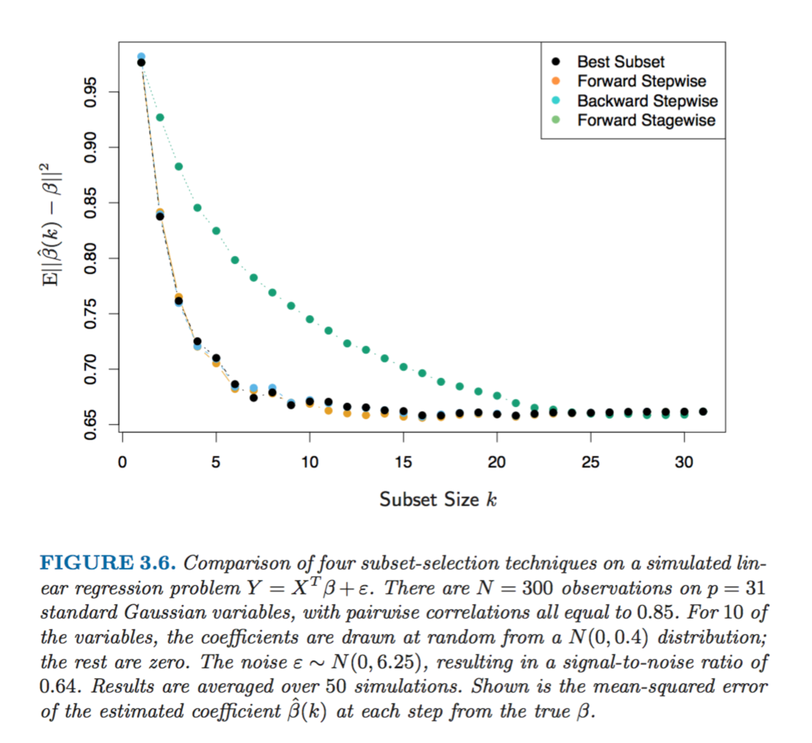

> March 24, 2017

### This is the post about
 
# Extraordinary Least Squares

****

****

Everyone had to use a linear regression at one point or another during their work- (or even life-) time, or at least came accross the concept during University studying time. But what if you could make this mundane tool much more exciting and efficient? Below are the list of things that Data Scientists put on top of the Ordinary Least Squares to make it a bit more extraordinary

### Variables (features) selection
   If you get some data set from the real world to analyse then it would probably have a few variables that would be correlated between each other. Or a few too many variables in total, most of which might not add a tremendous amount of explanatory power to your model. One of the ways to deal with it is to choose a subset of the variables (aka features), but testing each combinatoin can get really tedious (or unfeasible after the number of variables gets too large). Luckily, there are a few algorithms that can help with this problem: 
   
   + __*Leaps and bounds procedure (Furnival and Wilson, 1974)*__
   makes this selection process feasible for the number of variables as large as 30 or 40

  
   + __*Forward- stepwise selection*__
   starts with the intercept, and then sequentially adds into the model the predictor that most improves the fit

   + __*Backward-stepwise selection*__
   starts with the full model, and sequentially deletes the predictor that has the least impact on the fit
   
   + __*Hybrid stepwise-selection*__
   strategies that consider both forward and backward moves at each step, and select the “best” of the two (the _step_ function in    R)
   
   + __*Forward-stagewise regression*__  is even more constrained than forward-stepwise above. It starts like forward-stepwise regression, with an intercept equal to the mean, and then at each step the algorithm identifies the variable most correlated with the current residua, then computes the simple linear regression coefficient of the residual on this chosen variable, and then adds it to the current coefficient for that variable. This is continued till none of the variables have correlation with the residuals. *Although this is the slower algorythm than the other options (it takes more time to arrive at the same optimal solution) it is nevertheless pretty handy in higher dimensions problems*

****

> The figure below shows the simulation of methods above on a sample dataset

   
### Penalty functions
   Another way to 

> The source of the beautiful graphs and all the extraordinary information in this post is the book
> __"The Elements of Statistical Learning"__, *Trevor Hastie, Jerome H. Friedman, Robert Tibshirani*, February 2009
